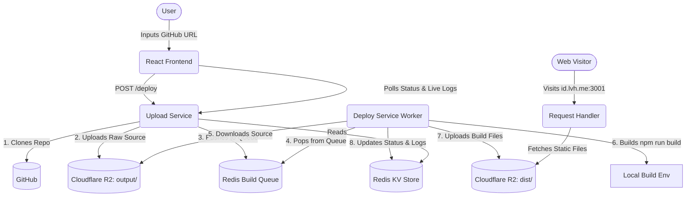

# Repo Deployer

A highly scalable, distributed platform that acts as a clone of Vercel. It allows users to input a public GitHub repository URL, automatically clones and builds the project in the cloud, and serves the static files dynamically on a custom subdomain.

## System Architecture

The project is built using a microservices architecture to ensure high availability, fault tolerance, and scalability. It utilizes a Redis queue to decouple the API ingestion from the heavy lifting of the build process.



## Microservices Breakdown

### 1. Frontend (React / Vite)
A modern, animated user interface where users can initiate deployments. It features a heuristic progress bar and a live terminal window that streams real-time deployment logs from the backend via polling.

### 2. Upload Service (Node.js / Express)
The entry point for the deployment pipeline. 
- Clones the target GitHub repository locally using `simple-git`.
- Uploads the raw source code files to a Cloudflare R2 bucket.
- Pushes the generated deployment ID to a Redis `build-queue`.
- Serves endpoints for the frontend to poll deployment status and live build logs.

### 3. Deploy Service (Node.js Worker)
An isolated background worker that listens to the Redis queue.
- Pops deployment IDs from the queue (blocking pop).
- Downloads the raw source code from Cloudflare R2.
- Executes `npm install` and `npm run build` in a child process.
- Uploads the final built static assets (from the `dist` folder) back to a separate namespace in Cloudflare R2.
- Pushes real-time execution logs back to Redis for the frontend to consume.

### 4. Request Handler (Node.js / Express)
A highly optimized dynamic reverse proxy.
- Intercepts incoming web traffic.
- Extracts the deployment ID from the host header.
- Fetches the corresponding built file directly from Cloudflare R2.
- Streams the content back to the visitor with appropriate `Content-Type` headers.

## Technology Stack

- **Frontend**: React, Vite, CSS
- **Backend**: Node.js, Express, TypeScript
- **Database/Queue**: Redis
- **Storage**: Cloudflare R2 (S3 Compatible Storage API)
- **Infrastructure**: AWS SDK (v3)

## Local Development Setup

### Prerequisites
- Node.js (v18+)
- Redis Server (Running locally on default port 6379)
- Cloudflare R2 Bucket (or any S3-compatible storage)

### Environment Variables
You must create a `.env` file in the root directory with the following keys:
```env
R2_ACCESS_KEY_ID="your_access_key"
R2_SECRET_ACCESS_KEY="your_secret_key"
R2_ENDPOINT="your_r2_endpoint_url"
R2_BUCKET_NAME="your_bucket_name"
```

### Starting the Platform
The project uses NPM Workspaces to manage all services concurrently.

1. Install dependencies from the root:
```bash
npm install
```

2. Build all TypeScript services:
```bash
npm run build
```

3. Start all services concurrently:
```bash
npm start
```

### Testing a Deployment
1. Open `http://localhost:5173` in your browser.
2. Enter a public React or HTML repository.
3. Watch the live logs as the system clones, builds, and uploads the project.
4. Click the generated `.lvh.me:3001` link to view your live deployment.
